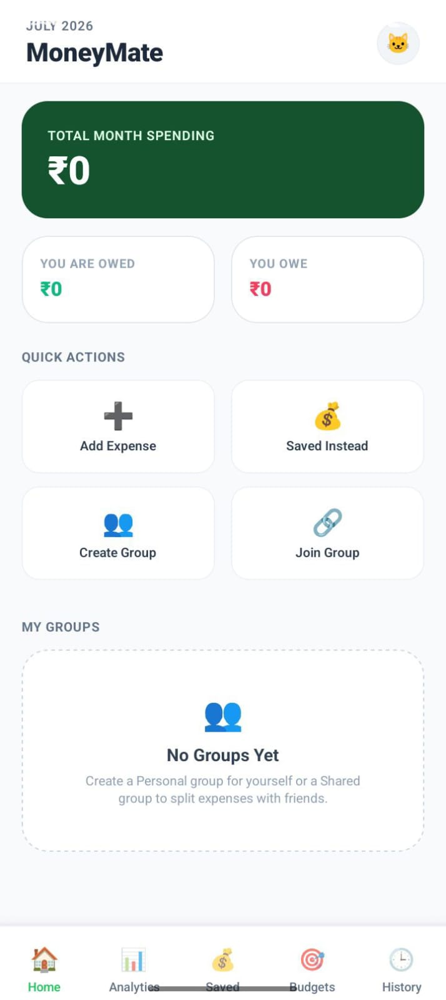
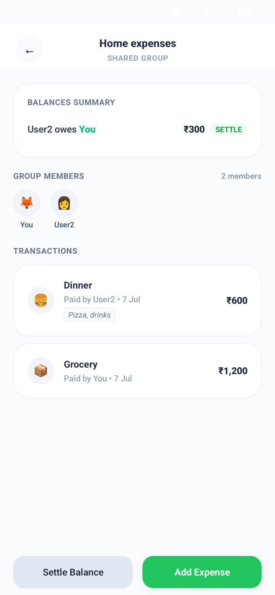

# MoneyMate 💸

<p align="center">
  <b>A self-hosted finance tracker & Splitwise-inspired expense manager</b>
</p>

<p align="center">
  Track shared expenses • Analyze spending • Build better money habits
</p>


---

## 💡 Why MoneyMate?

I wanted a simple expense-sharing app customized for real-life usage.

Existing apps worked well, but I wanted:

- 🚫 No daily expense limits
- 🔓 No premium restrictions
- 🎨 More personalization
- 🏠 Shared + personal finance tracking

So I built **MoneyMate** — a Splitwise-inspired tracker with extra personal finance features.


---

## 📸 Preview

<p align="center">
  
  &nbsp;
  
  &nbsp;
  
</p>


---

# ✨ Features


## 👥 Smart Expense Splitting

Split group expenses, calculate balances, and settle debts easily.

<p align="center">

</p>


## 📂 Shared & Personal Groups

Create separate spaces for:

- 🏠 Home expenses
- 👥 Partner/roommate expenses
- 🔒 Personal spending

<p align="center">

</p>


## 📊 Spending Analytics

Understand where your money goes using category-based insights.

<p align="center">

</p>


## 💰 Saved Instead Tracker

Skipped an unnecessary purchase?

Track that money as savings and build better spending habits.

<p align="center">

</p>


## 📱 Android Widgets

View balances and quick insights directly from your home screen.


---

# 🛠 Tech Stack

| Area | Technology |
|---|---|
| Mobile | React Native + Expo |
| Language | TypeScript |
| Styling | NativeWind |
| Database | Supabase PostgreSQL |
| Widgets | Native Android Widgets |


---

# 🚀 Getting Started


## 1. Clone

```bash
git clone https://github.com/bhumikabiyani/MoneyMate.git

cd MoneyMate
