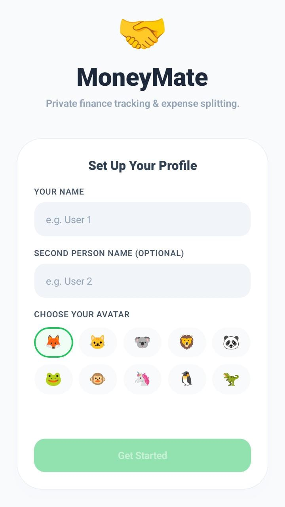
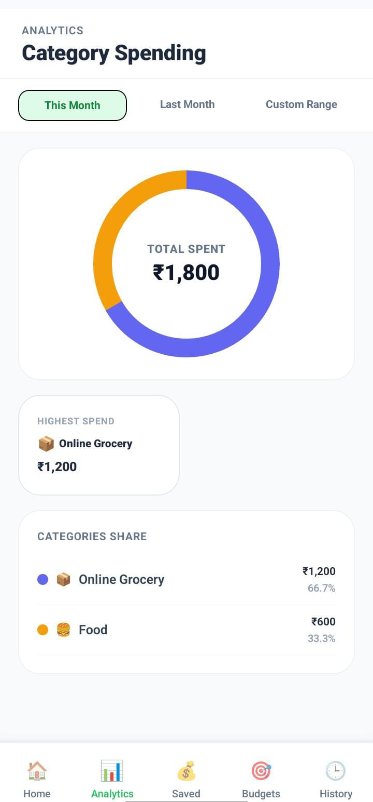

# MoneyMate 💸

<p align="center">
  <b>A self-hosted finance tracker & Splitwise-inspired expense manager</b>
</p>

<p align="center">
  Track shared expenses • Analyze spending • Build better money habits
</p>

---

## 💡 Why MoneyMate?

I wanted a simple expense-sharing app customized for real-life usage.

Existing apps worked well, but I wanted:

- 🚫 No daily expense limits
- 🔓 No premium restrictions
- 🎨 More personalization
- 🏠 Shared + personal finance tracking

So I built **MoneyMate** — a Splitwise-inspired tracker with extra personal finance features.

---

## 📸 Preview

<p align="center">
  
  &nbsp;
  
  &nbsp;
  
</p>

---

# ✨ Features

## 👥 Smart Expense Splitting

Split group expenses automatically, calculate balances, and settle debts easily.

<p align="center">

</p>

---

## 📂 Shared & Personal Groups

Create separate spaces for different needs:

- 🏠 Home expenses
- 👥 Partner / roommate expenses
- 🔒 Personal spending logs

<p align="center">

</p>

---

## 📊 Spending Analytics

Understand where your money goes with category-wise spending insights.

Track:

- Food
- Shopping
- Groceries
- Custom categories

<p align="center">

</p>

---

## 💰 Saved Instead Tracker

Ever stopped yourself from buying something unnecessary?

Log that amount as "saved instead" and build better spending habits.

<p align="center">

</p>

---

## 📱 Android Native Widgets

Quickly view finance insights directly from your Android home screen.

> Note: Widgets require a native Android build and are not supported inside Expo Go.

---

# 🛠 Tech Stack

| Area | Technology |
|---|---|
| Mobile | React Native + Expo |
| Language | TypeScript |
| Styling | NativeWind (TailwindCSS) |
| Database | Supabase PostgreSQL |
| Storage / Sync | Supabase Client |
| Widgets | Native Android Widgets |

---

# 🚀 Getting Started

Follow these steps to run MoneyMate locally.

---

## 1. Clone Repository

```bash
git clone https://github.com/bhumikabiyani/MoneyMate.git

cd MoneyMate
```

---

## 2. Install Dependencies

```bash
npm install
```

---

## 3. Setup Supabase

Create your own Supabase project.

Then create:

```bash
.env
```

Add:

```env
EXPO_PUBLIC_SUPABASE_URL=your_supabase_project_url

EXPO_PUBLIC_SUPABASE_ANON_KEY=your_supabase_publishable_key
```

Initialize database tables using:

```text
src/database/schema.sql
```

Detailed setup:

📖 See `docs/SUPABASE_SETUP.md`

---

## 4. Run App

Start Expo:

```bash
npx expo start
```

For Android:

Press:

```text
a
```

or scan QR using Expo Go.

---

# 📦 Build Android APK

For a standalone installable APK:

Install EAS:

```bash
npm install -g eas-cli
```

Login:

```bash
eas login
```

Configure:

```bash
eas build:configure
```

Build APK:

```bash
eas build --platform android --profile preview
```

Install generated APK on your device.

---

# 🎨 Customization

MoneyMate is designed to be modified.

You can customize:

### Expense Categories

Edit:

```text
src/utils/constants.ts
```

Examples:

- Food
- Travel
- Shopping
- Subscriptions

---

### Database Schema

Modify:

```text
src/database/schema.sql
```

---

### Android Widgets

Widget source:

```text
android/app/src/main/java/.../widgets
```

---

### Theme

Modify:

```text
tailwind.config.js
```

Full guide:

📖 See `docs/CUSTOMIZATION.md`

---

# 🔐 Privacy & Data Ownership

MoneyMate is built as a self-hosted personal finance tracker.

Unlike traditional finance apps where your data lives on company servers, MoneyMate connects to **your own Supabase database**.

You control:

- Your database
- Your environment variables
- Your financial data

Authentication is intentionally not included in the default setup because MoneyMate targets:

- 👤 Personal usage
- 👫 Couples
- 🏠 Roommates
- 👨‍👩‍👧 Family groups
- 🔒 Private deployments

Every user creates their own Supabase backend.

---

# ⚠️ Security Note

MoneyMate is intended for private self-hosted usage.

Do not:

- Commit `.env`
- Share your Supabase keys publicly
- Use one database for unknown users

For a public multi-user deployment, add:

- Supabase Auth
- Row Level Security policies

---

# 🗺 Roadmap

Future improvements:

- [ ] Receipt scanning
- [ ] Budget alerts
- [ ] Recurring expenses
- [ ] Export monthly reports
- [ ] Optional authentication
- [ ] AI spending insights

---

# ⭐ Support

If you like the project:

⭐ Star the repo  
🍴 Fork and customize it  
💡 Build your own personal finance workflow

---

Built with ❤️ as a personal finance experiment.
